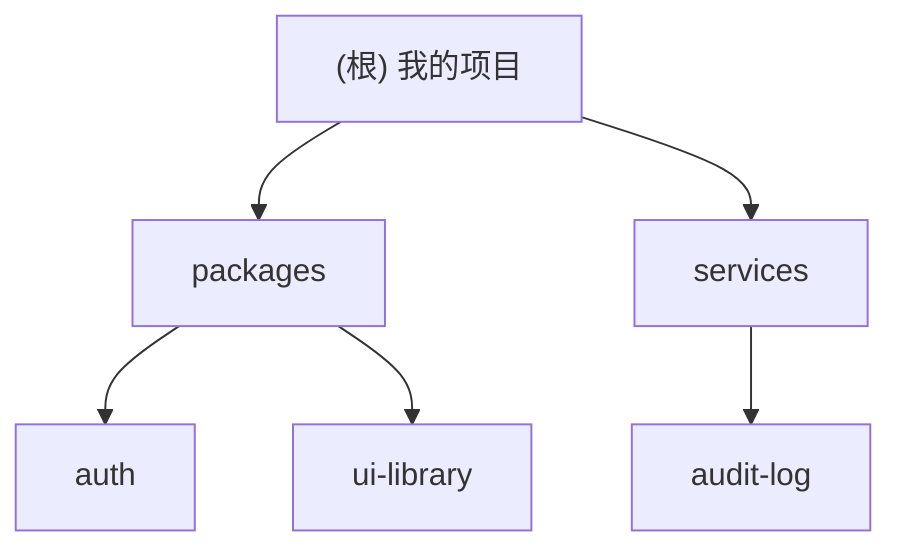

# 项目初始化 Skill

自适应扫描仓库，生成「根级简明 + 模块级详尽」的 AI 上下文文档。

## 功能特性

- **智能框架识别**：自动识别 50+ 种框架和工具链
- **并行扫描**：多模块并行处理，提升大型仓库扫描效率
- **增量更新**：基于文件 hash 的智能增量更新
- **进度反馈**：实时显示扫描进度和预估时间
- **质量评估**：自动评估文档完整性并提供改进建议
- **安全检测**：敏感信息泄露检测和警告

## 触发条件

当用户请求以下任意操作时使用此 skill：

- 初始化项目的 AI 上下文
- 生成或更新 CLAUDE.md / AGENTS.md
- 为项目创建模块级文档
- 扫描项目结构并生成索引

## 核心原则

- **根级轻量**：根文档仅包含全局愿景、架构总览、模块索引（约 100-200 行）
- **模块详尽**：每个模块的文档包含入口、接口、依赖、测试、数据模型等
- **最近优先**：AI 代理读取距离编辑文件最近的文档
- **增量更新**：重复运行时只更新变化部分，不重复扫描
- **覆盖率透明**：每次运行都报告扫描覆盖率和缺口

## 工作流程

### 阶段 0：准备

1. **确定输出格式**：如果未指定则询问用户选择 `CLAUDE.md` 还是 `AGENTS.md`
2. **确定索引位置**：根据输出格式自动确定：
   - `CLAUDE.md` → `.claude/index.json`
   - `AGENTS.md` → `.agents/index.json`
3. **获取时间戳**：获取当前时间的 ISO-8601 格式时间戳（如 `2026-05-07T12:00:00+08:00`）。
4. **检查已有文档**：检测根目录和各模块目录下是否已存在目标文件。
   - 如果已存在：进入增量更新模式。
   - 如果不存在：全新生成。

### 阶段 A：全仓清点（轻量）

以多次 `Glob` 分批获取文件清单（避免单次超限），完成以下工作：

- 文件计数与语言占比统计
- 目录拓扑映射
- 模块候选发现：识别 `package.json`、`pyproject.toml`、`go.mod`、`Cargo.toml`、`apps/*`、`packages/*`、`services/*`、`cmd/*` 等

生成 **模块候选列表**，为每个候选标注：

| 属性 | 说明 |
|------|------|
| 语言 | 主要编程语言 |
| 入口文件 | 猜测的入口点（main.ts、index.ts、app.py 等） |
| 测试目录 | 是否存在 |
| 配置文件 | 是否存在 |

### 阶段 B：模块优先扫描（中等）

对每个模块，按以下顺序尝试读取（分批、分页）：

1. **入口与启动**：`main.ts`/`index.ts`/`cmd/*/main.go`/`app.py`/`src/main.rs` 等
2. **对外接口**：API 路由、CLI 命令、导出函数、SDK 方法、事件、Hook、proto/openapi 等
3. **依赖与脚本**：`package.json scripts`、`pyproject.toml`、`go.mod`、`Cargo.toml`
4. **数据层**：`schema.sql`、`prisma/schema.prisma`、ORM 模型、迁移目录
5. **测试**：`tests/**`、`__tests__/**`、`*_test.go`、`*.spec.ts` 等
6. **质量工具**：`eslint`/`ruff`/`golangci` 等配置

形成 **模块快照**：只抽取高信号片段与路径，不粘贴大段代码。

### 阶段 C：深度补捞（按需触发）

满足以下任一条件时触发：

- 仓库整体较小（文件数较少）
- 阶段 B 后仍无法判断关键接口/数据模型/测试策略
- 根或模块文档缺信息项

动作：对目标目录追加分页读取，补齐缺项。

> **注意**：如果分页/次数达到工具或时间上限，必须提前写出部分结果并在摘要中说明原因和下一步建议。

## 忽略规则

1. 优先读取项目根目录的 `.gitignore` 文件
2. 如果不存在，使用默认忽略规则：`node_modules/**,.git/**,.github/**,dist/**,build/**,.next/**,__pycache__/**,*.lock,*.log,*.bin,*.pdf,*.png,*.jpg,*.jpeg,*.gif,*.mp4,*.zip,*.tar,*.gz,.env,.env.*,credentials.*,*secret*,*.key,*.pem`
3. 合并两种规则使用
4. 对大文件/二进制只记录路径，不读内容
5. **安全优先**：始终忽略 `.env`、`credentials.*`、`*secret*`、`*.key`、`*.pem` 等敏感文件，即使 .gitignore 中未列出

## 产物生成

### 1. 根级文档（CLAUDE.md 或 AGENTS.md）

参见 `references/root-template.md` 获取完整模板。

核心结构：

```
# 项目名称

## 项目愿景
[1-2 句话描述]

## 架构总览
[技术栈、架构模式]

## 模块结构图（Mermaid）
[自动生成的 Mermaid 树形图，节点可点击链接到模块文档]

## 模块索引
[表格形式：路径、职责、语言、入口]

## 运行与开发
[安装、构建、启动、测试命令]

## 编码规范
[代码风格、提交格式、分支策略]

## AI 使用指引
[代理应遵循的规则]
```

### 2. 模块级文档

参见 `references/module-template.md` 获取完整模板。

每个模块目录下生成的文档结构：

```
[面包屑导航：根目录 > 父目录 > 当前模块]

## 模块职责
[一句话描述]

## 入口与启动
[入口文件、启动命令]

## 对外接口
[API 路由、CLI 命令、导出函数、SDK 方法、事件、Hook、协议定义等]

## 关键依赖与配置
[依赖列表、配置文件说明]

## 数据模型
[数据库 schema、ORM 模型]

## 测试与质量
[测试命令、覆盖率、lint 配置]

## 常见问题 (FAQ)
[模块特有的坑和注意事项]

## 相关文件清单
[关键文件路径列表]
```

### 3. 索引文件（位置由输出格式决定）

根据阶段 0 确定的输出格式，索引文件位置为：
- `CLAUDE.md` → `.claude/index.json`
- `AGENTS.md` → `.agents/index.json`

参见 `references/index-schema.md` 获取完整 schema。

记录扫描元数据：

- 时间戳（ISO-8601 格式）
- 上次扫描时间戳（用于增量更新对比）
- 变化摘要（新增/移除/更新的模块和文件数量）
- 根/模块列表
- 每个模块的入口/接口/测试/重要路径
- 扫描覆盖率
- 忽略统计
- 是否因上限被截断（`truncated: true`）
- 缺口清单（下次运行时优先补齐）

## 覆盖率报告

每次运行都计算并打印：

- 估算总文件数、已扫描文件数、覆盖百分比
- 每个模块的覆盖摘要与缺口（缺接口、缺测试、缺数据模型等）
- 被忽略/跳过的 Top 目录与原因

## 结果摘要（打印到主对话）

- 根/模块文档新建或更新状态
- 模块列表（路径 + 一句话职责）
- 覆盖率与主要缺口
- 若未读全：说明原因，并列出推荐的下一步

## 安全与边界

- **只读扫描**：不修改源代码，仅生成/更新文档与索引
- **默认忽略**：常见生成物、二进制大文件、依赖目录
- **增量更新**：重复运行时按上次索引做增量更新与断点续扫

## 自适应执行策略

不需要用户传参，内部自动选择扫描强度：

| 仓库规模 | 策略 |
|----------|------|
| 小型（<50 文件） | 三阶段全跑，阶段 C 扩大读取面 |
| 中型（50-500 文件） | 标准三阶段 |
| 大型（>500 文件） | 阶段 B 精选高价值路径，阶段 C 按需 |

## Mermaid 图生成规则

在根文档的「模块索引」表格上方，生成 Mermaid `graph TD` 树形图：

- 每个节点可点击，链接到对应模块的文档文件
- 使用相对路径
- 仅包含已识别的模块目录

示例：



## 面包屑导航规则

在每个模块文档的最顶部，插入相对路径面包屑（根据输出格式使用对应的文档文件名）：

```
[根目录](../../{{DOC_FILENAME}}) > {{PARENT_BREADCRUMBS}} > **{{MODULE_NAME}}**
```

示例（假设 output_format 为 CLAUDE.md）：
```
[根目录](../../CLAUDE.md) > [packages](../) > **auth**
```

链接使用相对路径，指向根文档和各级父目录。

## 智能框架识别

自动识别以下框架和工具链，提取关键配置和约定：

### 前端框架
| 框架 | 识别标志 | 提取信息 |
|------|----------|----------|
| React | `react` 依赖、`jsx/tsx` 文件 | 组件结构、路由配置、状态管理 |
| Vue | `vue` 依赖、`.vue` 文件 | 组件结构、路由、Vuex/Pinia |
| Angular | `@angular/core`、`angular.json` | 模块结构、服务、路由 |
| Svelte | `svelte` 依赖、`.svelte` 文件 | 组件、Store |
| Next.js | `next` 依赖、`pages/` 或 `app/` | 路由、API Routes、SSR/SSG |
| Nuxt | `nuxt` 依赖、`nuxt.config.ts` | 路由、中间件、插件 |

### 后端框架
| 框架 | 识别标志 | 提取信息 |
|------|----------|----------|
| Express | `express` 依赖 | 路由、中间件 |
| NestJS | `@nestjs/core` | 模块、控制器、服务、守卫 |
| FastAPI | `fastapi` 依赖 | 路由、Pydantic 模型、依赖注入 |
| Django | `django` 依赖、`settings.py` | 应用、模型、URL 配置 |
| Spring Boot | `spring-boot` 依赖 | 控制器、服务、仓库 |
| Gin | `github.com/gin-gonic/gin` | 路由、中间件 |

### 数据库和 ORM
| 工具 | 识别标志 | 提取信息 |
|------|----------|----------|
| Prisma | `prisma/schema.prisma` | 数据模型、关系、迁移 |
| TypeORM | `typeorm` 依赖 | 实体、迁移 |
| SQLAlchemy | `sqlalchemy` 依赖 | 模型、关系 |
| Drizzle | `drizzle-orm` 依赖 | Schema、迁移 |

### 构建和部署
| 工具 | 识别标志 | 提取信息 |
|------|----------|----------|
| Docker | `Dockerfile`、`docker-compose.yml` | 镜像构建、服务编排 |
| Webpack | `webpack.config.js` | 入口、输出、插件 |
| Vite | `vite.config.ts` | 插件、构建配置 |
| Turborepo | `turbo.json` | 任务管道、依赖图 |
| Nx | `nx.json` | 项目图、任务 |

### 测试框架
| 框架 | 识别标志 | 提取信息 |
|------|----------|----------|
| Jest | `jest.config.*` | 测试配置、覆盖率 |
| Vitest | `vitest.config.*` | 测试配置 |
| pytest | `pytest.ini`、`conftest.py` | 测试配置、fixtures |
| Mocha | `.mocharc.*` | 测试配置 |

## 并行扫描策略

对于大型仓库（>200 文件），采用并行扫描提升效率：

### 模块级并行
```
扫描计划：
├── 模块 A (独立) ──→ 并行扫描
├── 模块 B (独立) ──→ 并行扫描
└── 模块 C (依赖 A) ──→ 等待 A 完成后扫描
```

### 批次策略
| 仓库规模 | 批次大小 | 并行度 |
|----------|----------|--------|
| 小型 (<100) | 全部 | 1 |
| 中型 (100-500) | 10-20 模块 | 3-5 |
| 大型 (>500) | 20-50 模块 | 5-10 |

### 进度追踪
```json
{
  "total_modules": 25,
  "scanned_modules": 15,
  "current_batch": [16, 17, 18, 19, 20],
  "estimated_remaining": "2m 30s",
  "coverage_percent": 60.0
}
```

## 错误处理与恢复

### 断点续扫
1. **保存扫描状态**：每完成一个模块，更新 `index.json` 中的扫描进度
2. **失败记录**：记录失败的模块和原因到 `index.json` 的 `failed_modules` 字段
3. **恢复策略**：下次运行时优先扫描失败的模块

### 错误分类
| 错误类型 | 处理策略 | 是否阻断 |
|----------|----------|----------|
| 文件读取权限 | 跳过并记录 | 否 |
| 文件过大 (>10MB) | 跳过并记录路径 | 否 |
| 编码错误 | 尝试 latin1 降级 | 否 |
| 循环依赖 | 记录警告 | 否 |
| 磁盘空间不足 | 停止并报告 | 是 |
| 工具调用超时 | 重试 3 次后跳过 | 否 |

### 重试策略
```
重试配置：
- 最大重试次数：3
- 重试间隔：指数退避 (1s, 2s, 4s)
- 超时时间：单文件 10s，单模块 60s
```

## 安全检测

### 敏感信息检测
扫描时自动检测以下敏感信息模式：

| 类型 | 模式 | 严重程度 |
|------|------|----------|
| API Key | `sk-*`、`api_key=`、`AKIA*` | 高 |
| 密码 | `password=`、`passwd=`、`pwd=` | 高 |
| 私钥 | `-----BEGIN.*PRIVATE KEY-----` | 高 |
| Token | `token=`、`bearer `、`ghp_*` | 中 |
| 内部 URL | `internal.*`、`*.local`、`10.*`、`172.*` | 低 |

### 安全报告
检测到敏感信息时，在摘要中添加安全警告：

```
⚠️ 安全警告：
- 检测到 3 个潜在的 API Key 泄露
- 检测到 1 个硬编码密码
- 建议：将敏感信息移至环境变量或密钥管理服务
```

## 文档质量评估

### 完整性评分
每个模块文档生成后，计算完整性评分：

| 维度 | 权重 | 评分标准 |
|------|------|----------|
| 入口与启动 | 15% | 是否有入口文件和启动命令 |
| 对外接口 | 25% | 接口数量和描述完整性 |
| 依赖与配置 | 15% | 依赖列表和配置说明 |
| 数据模型 | 20% | 模型定义和关系说明 |
| 测试与质量 | 15% | 测试覆盖和质量工具 |
| FAQ | 10% | 常见问题和注意事项 |

### 质量等级
| 等级 | 分数 | 说明 |
|------|------|------|
| A | 90-100 | 文档完整，可直接使用 |
| B | 70-89 | 基本完整，部分信息缺失 |
| C | 50-69 | 框架存在，需要补充 |
| D | <50 | 严重不完整，建议重新扫描 |

### 改进建议
根据质量评分，自动生成改进建议：

```
📋 文档质量报告：

packages/auth (评分: 75/100 - B级)
  ✅ 入口与启动：完整
  ⚠️ 对外接口：缺少 3 个 API 端点描述
  ✅ 依赖与配置：完整
  ❌ 数据模型：未找到 Prisma schema
  ✅ 测试与质量：完整
  ⚠️ FAQ：建议添加认证流程说明

建议下一步：
1. 补充 packages/auth/src/routes/*.ts 的接口文档
2. 创建或链接 Prisma schema 文档
```

## 增量更新优化

### 变化检测
使用文件 hash 检测变化，避免不必要的重新扫描：

```json
{
  "file_hashes": {
    "packages/auth/src/index.ts": "abc123",
    "packages/auth/package.json": "def456"
  }
}
```

### 更新策略
| 变化类型 | 处理方式 |
|----------|----------|
| 文件内容变化 | 重新扫描该模块 |
| 新增模块 | 完整扫描新模块 |
| 删除模块 | 移除文档和索引条目 |
| 配置变化 | 重新扫描相关模块 |
| 依赖变化 | 更新依赖信息 |

## 性能优化

### 批量读取
- 使用 `Glob` 批量获取文件列表，减少工具调用次数
- 对同一目录的多个文件，合并为一次读取请求
- 限制单次读取的文件数量（建议 10-20 个）

### 缓存策略
- 缓存已解析的配置文件内容
- 缓存框架识别结果
- 缓存依赖树结构

### 内存管理
- 大型仓库分批处理，避免一次性加载所有模块信息
- 及时释放已处理模块的临时数据
- 限制同时处理的模块数量

## 扩展性

### 自定义模板
支持用户自定义文档模板：

```
项目根目录/
├── .project-init/
│   ├── root-template.md      # 自定义根文档模板
│   ├── module-template.md    # 自定义模块文档模板
│   └── ignore-patterns.txt   # 自定义忽略规则
```

### 插件机制
支持通过配置文件扩展识别规则：

```json
{
  "custom_frameworks": {
    "my-framework": {
      "detection_markers": ["my-framework/package.json"],
      "extraction_patterns": {
        "routes": "src/routes/**/*.ts",
        "models": "src/models/**/*.ts"
      }
    }
  }
}
```

## 使用示例

### 基础使用
```
用户：初始化项目
AI：[运行 project-init skill]
    - 检测到 Node.js + TypeScript 项目
    - 识别到 5 个模块
    - 生成 CLAUDE.md 和模块文档
    - 覆盖率：85%
```

### 指定输出格式
```
用户：生成 AGENTS.md
AI：[运行 project-init skill，输出格式为 AGENTS.md]
```

### 增量更新
```
用户：更新项目文档
AI：[检测到 2 个模块有变化，仅更新变化部分]
    - 更新 packages/auth 文档
    - 更新 services/api 文档
    - 耗时：45s
```

## 最佳实践

1. **定期更新**：建议在重大功能变更后运行更新
2. **版本控制**：将生成的文档纳入版本控制
3. **团队协作**：团队成员共同维护 FAQ 和注意事项
4. **质量检查**：定期检查文档质量评分，补充缺失信息
5. **安全审查**：关注安全警告，及时处理敏感信息泄露
