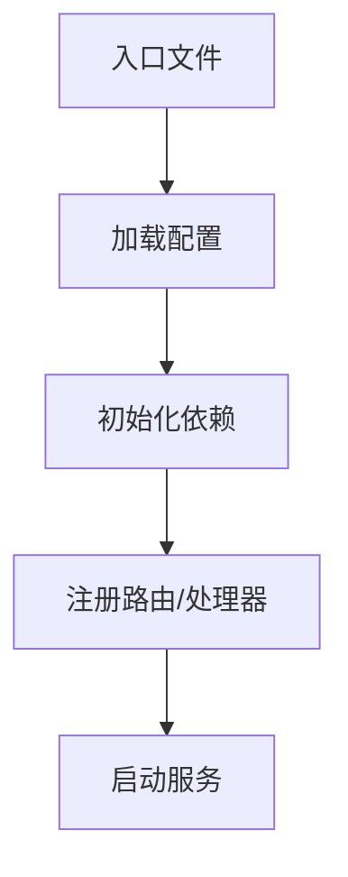

# 模块级文档模板

> 模块文档包含该模块的详细技术信息。
> 使用 `{{placeholder}}` 标记需要填充的内容。
> 带 `[可选]` 标记的章节根据模块实际情况选择性包含。

---

[根目录](../../{{DOC_FILENAME}}) > {{PARENT_BREADCRUMBS}} > **{{MODULE_NAME}}**

## 模块概述

| 维度 | 说明 |
|------|------|
| 职责 | {{1-2 句话描述此模块的核心功能}} |
| 状态 | {{stable/beta/deprecated/experimental}} |
| 维护者 | {{团队或个人}} |
| 语言 | {{主要编程语言及版本}} |
| 框架 | {{使用的框架}} |

## 入口与启动

### 入口文件

| 文件 | 说明 | 类型 |
|------|------|------|
| `{{入口文件}}` | {{说明}} | {{main/lib/cli/worker}} |

### 启动命令

```bash
# 开发模式
{{开发启动命令}}

# 生产模式
{{生产启动命令}}

# 调试模式
{{调试启动命令}}
```

### 启动流程



## 对外接口

### API 路由

| 方法 | 路径 | 说明 | 认证 | 权限 |
|------|------|------|------|------|
| `{{GET/POST/PUT/DELETE}}` | `/{{路径}}` | {{说明}} | {{是/否}} | {{权限}} |

### CLI 命令

| 命令 | 说明 | 参数 |
|------|------|------|
| `{{命令}}` | {{说明}} | `{{参数列表}}` |

### 导出函数/类

| 名称 | 类型 | 说明 | 签名 |
|------|------|------|------|
| `{{名称}}` | {{function/class/interface}} | {{说明}} | `{{签名}}` |

### 事件/消息

| 事件名 | 触发时机 | 负载 |
|--------|----------|------|
| `{{事件名}}` | {{触发条件}} | `{{负载结构}}` |

### Hook/中间件

| 名称 | 类型 | 说明 |
|------|------|------|
| `{{名称}}` | {{hook/middleware}} | {{说明}} |

### 协议定义

{{gRPC/GraphQL/WebSocket 等协议定义}}

```protobuf
// 或 GraphQL schema 或 WebSocket 消息格式
{{协议定义内容}}
```

## 关键依赖与配置

### 核心依赖

| 依赖 | 版本 | 用途 | 类型 |
|------|------|------|------|
| `{{依赖名}}` | `{{版本}}` | {{用途}} | {{runtime/dev/peer}} |

### 配置文件

| 文件 | 格式 | 说明 |
|------|------|------|
| `{{配置文件路径}}` | {{JSON/YAML/TOML}} | {{说明}} |

### 配置项

| 配置项 | 类型 | 必填 | 默认值 | 说明 |
|--------|------|------|--------|------|
| `{{配置项}}` | {{类型}} | {{是/否}} | `{{默认值}}` | {{说明}} |

### 环境变量

| 变量名 | 说明 | 必填 | 默认值 |
|--------|------|------|--------|
| `{{变量名}}` | {{说明}} | {{是/否}} | `{{默认值}}` |

## 数据模型

### 数据库 Schema

{{数据库 schema、ORM 模型、类型定义等}}

```sql
-- 或 Prisma schema 或 ORM 模型定义
{{Schema 定义}}
```

### 模型列表

| 模型 | 说明 | 关键字段 | 关系 |
|------|------|----------|------|
| `{{模型名}}` | {{说明}} | `{{字段列表}}` | {{关联模型}} |

### [可选] 数据流


### [可选] 数据迁移

| 迁移文件 | 说明 | 状态 |
|----------|------|------|
| `{{迁移文件}}` | {{说明}} | {{pending/applied}} |

## 测试与质量

### 测试概览

| 维度 | 说明 |
|------|------|
| 测试框架 | {{框架}} |
| 测试命令 | `{{命令}}` |
| 测试文件模式 | `{{模式}}` |
| 覆盖率要求 | {{最低覆盖率}} |

### 测试类型

| 类型 | 目录 | 命令 | 说明 |
|------|------|------|------|
| 单元测试 | `{{目录}}` | `{{命令}}` | {{说明}} |
| 集成测试 | `{{目录}}` | `{{命令}}` | {{说明}} |
| E2E 测试 | `{{目录}}` | `{{命令}}` | {{说明}} |

### 运行测试

```bash
# 运行所有测试
{{测试命令}}

# 运行特定测试
{{特定测试命令}}

# 运行带覆盖率的测试
{{覆盖率命令}}
```

### 代码质量

| 工具 | 配置文件 | 命令 |
|------|----------|------|
| Lint | `{{配置文件}}` | `{{lint 命令}}` |
| Format | `{{配置文件}}` | `{{格式化命令}}` |
| Type Check | `{{配置文件}}` | `{{类型检查命令}}` |

## [可选] 架构设计

### 组件关系

```mermaid
classDiagram
    class {{类名1}} {
        +{{方法}}
    }
    class {{类名2}} {
        +{{方法}}
    }
    {{类名1}} --> {{类名2}} : {{关系}}
```

### 设计模式

- **{{模式名}}**：{{使用场景和原因}}

### [可选] 性能考虑

- **缓存策略**：{{说明}}
- **并发处理**：{{说明}}
- **资源限制**：{{说明}}

## [可选] 部署配置

### Docker

```dockerfile
{{Dockerfile 内容}}
```

### 环境要求

| 资源 | 最低要求 | 推荐 |
|------|----------|------|
| CPU | {{数量}} | {{数量}} |
| 内存 | {{大小}} | {{大小}} |
| 存储 | {{大小}} | {{大小}} |

## [可选] 监控与日志

### 日志配置

| 级别 | 输出 | 格式 |
|------|------|------|
| {{级别}} | {{文件/控制台}} | {{JSON/文本}} |

### 监控指标

| 指标 | 说明 | 阈值 |
|------|------|------|
| {{指标名}} | {{说明}} | {{阈值}} |

## [可选] 安全考虑

- **输入验证**：{{验证策略}}
- **认证授权**：{{机制}}
- **数据保护**：{{加密和脱敏}}
- **依赖安全**：{{依赖扫描策略}}

## 常见问题 (FAQ)

1. **{{问题1}}**
   {{解答}}

2. **{{问题2}}**
   {{解答}}

3. **{{问题3}}**
   {{解答}}

## [可选] 已知限制

1. {{限制1}}
2. {{限制2}}

## [可选] 路线图

- [ ] {{计划功能1}}
- [ ] {{计划功能2}}

## 相关文件清单

### 核心文件

| 文件 | 说明 |
|------|------|
| `{{文件路径}}` | {{说明}} |

### 配置文件

| 文件 | 说明 |
|------|------|
| `{{文件路径}}` | {{说明}} |

### 测试文件

| 文件 | 说明 |
|------|------|
| `{{文件路径}}` | {{说明}} |

### 文档文件

| 文件 | 说明 |
|------|------|
| `{{文件路径}}` | {{说明}} |

## [可选] 变更历史

查看 [CHANGELOG.md](./CHANGELOG.md) 了解模块变更历史。
