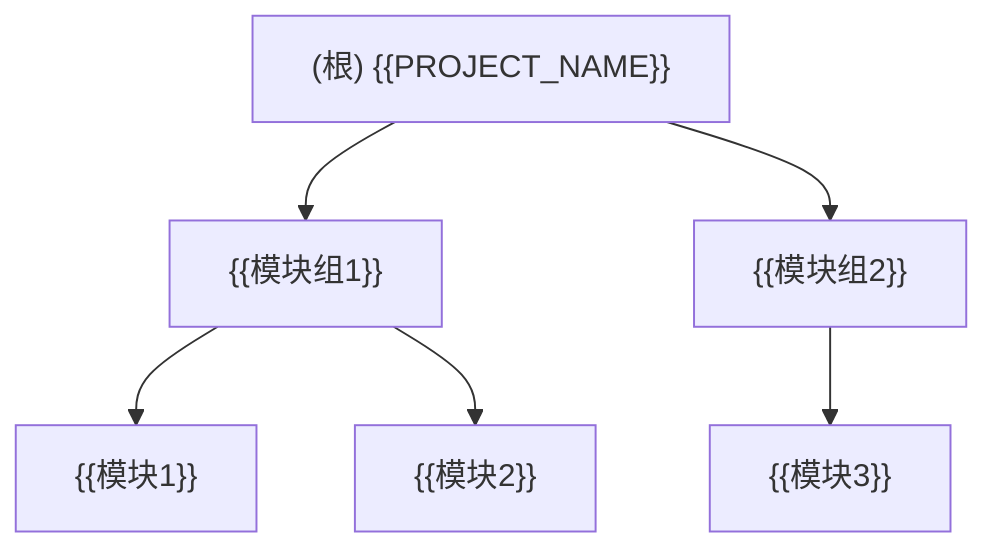
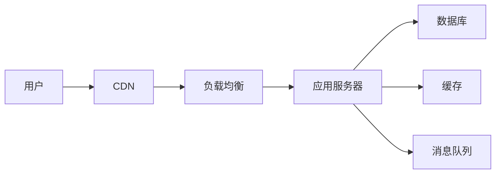
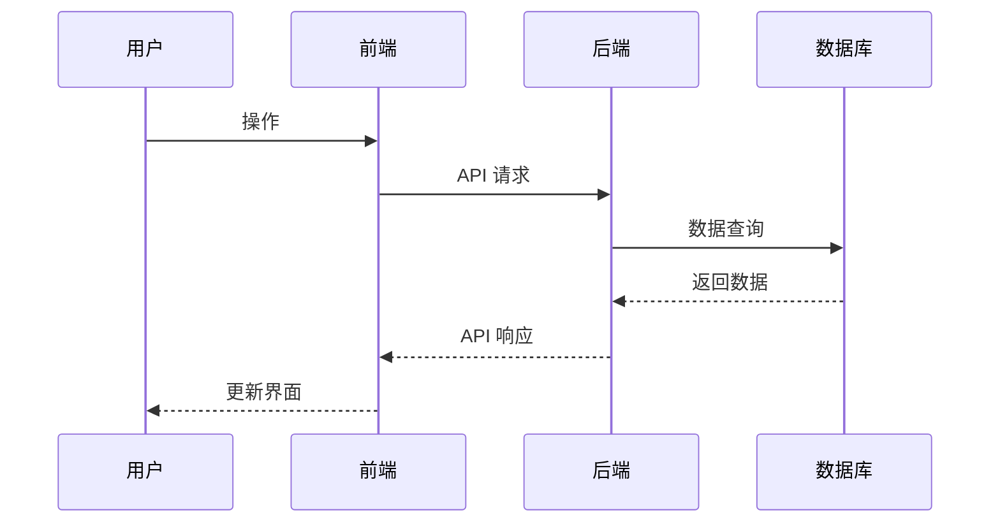

# 根级文档模板

> 根文档保持轻量（约 100-200 行），仅包含全局信息和模块索引。
> 使用 `{{placeholder}}` 标记需要填充的内容。
> 带 `[可选]` 标记的章节根据项目实际情况选择性包含。

---

# {{PROJECT_NAME}}

## 项目愿景

{{1-2 句话描述项目目的和核心价值}}

## 架构总览

| 维度 | 说明 |
|------|------|
| 语言 | {{主要语言及版本}} |
| 框架 | {{核心框架}} |
| 构建 | {{构建工具}} |
| 包管理 | {{包管理器}} |
| 部署 | {{部署方式}} |
| 运行时 | {{Node.js 18+ / Python 3.11+ / Go 1.21+ 等}} |

## 模块结构图



## 模块索引

| 路径 | 职责 | 语言 | 入口 | 状态 |
|------|------|------|------|------|
| `{{模块路径}}` | {{一句话职责}} | {{语言}} | `{{入口文件}}` | {{stable/beta/deprecated}} |

## 运行与开发

### 环境要求

```bash
{{Node.js >= 18.0.0}}
{{pnpm >= 8.0.0}}
{{其他依赖}}
```

### 常用命令

```bash
{{安装命令}}        # 安装依赖
{{构建命令}}        # 构建项目
{{启动命令}}        # 启动开发服务器
{{测试命令}}        # 运行测试
{{lint命令}}        # 代码检查
{{格式化命令}}      # 代码格式化
```

### 开发工作流

```bash
{{克隆仓库}}
{{安装依赖}}
{{启动开发}}
{{运行测试}}
{{提交代码}}
```

## 测试策略

- **单元测试**：{{框架、文件模式、命令}}
- **集成测试**：{{框架、文件模式、命令}}
- **E2E 测试**：{{框架、文件模式、命令}}
- **覆盖率要求**：{{最低覆盖率阈值}}

## 编码规范

- 代码风格：{{风格工具及配置文件}}
- 提交格式：{{commit message 格式，如 Conventional Commits}}
- 分支策略：{{分支命名规则，如 feature/*、fix/*、release/*}}
- 代码审查：{{PR 审查要求}}

## [可选] 部署架构



| 环境 | 地址 | 说明 |
|------|------|------|
| 开发 | `{{dev-url}}` | 开发环境 |
| 测试 | `{{staging-url}}` | 测试环境 |
| 生产 | `{{prod-url}}` | 生产环境 |

## [可选] API 概览

| 模块 | 端点前缀 | 认证方式 | 文档 |
|------|----------|----------|------|
| `{{模块名}}` | `/api/{{路径}}` | {{JWT/API Key/OAuth}} | [链接]({{文档URL}}) |

## [可选] 数据流



## [可选] 环境变量

| 变量名 | 说明 | 必填 | 默认值 |
|--------|------|------|--------|
| `{{变量名}}` | {{说明}} | {{是/否}} | `{{默认值}}` |

> 完整的环境变量列表参见 `.env.example`

## [可选] 监控与告警

| 指标 | 阈值 | 告警渠道 |
|------|------|----------|
| 响应时间 | >500ms | {{Slack/邮件}} |
| 错误率 | >1% | {{Slack/邮件}} |
| CPU 使用率 | >80% | {{Slack/邮件}} |

## [可选] 安全考虑

- **认证**：{{认证机制}}
- **授权**：{{授权模型，如 RBAC}}
- **数据加密**：{{传输和存储加密}}
- **敏感信息**：{{密钥管理方式}}

## AI 使用指引

### 通用规则

- 运行 `{{验证命令}}` 确认代码质量
- 保持 PR 聚焦于单一关注点
- 遵循项目的代码风格和提交格式

### 模块特定规则

{{根据模块特点添加特定的 AI 使用规则}}

### 常见陷阱

1. {{陷阱1及避免方法}}
2. {{陷阱2及避免方法}}

### 有用的命令

```bash
{{调试命令}}
{{日志查看命令}}
{{数据库操作命令}}
```

## [可选] 故障排查

| 问题 | 可能原因 | 解决方案 |
|------|----------|----------|
| {{问题描述}} | {{原因}} | {{解决方案}} |

## [可选] 性能优化

- **前端**：{{优化策略}}
- **后端**：{{优化策略}}
- **数据库**：{{优化策略}}

## [可选] 国际化

- 默认语言：{{语言}}
- 支持语言：{{语言列表}}
- 翻译文件位置：{{路径}}

## [可选] 变更日志

查看 [CHANGELOG.md](./CHANGELOG.md) 了解版本历史。

## 相关文档

- [API 文档]({{链接}})
- [部署指南]({{链接}})
- [贡献指南]({{链接}})
- [架构决策记录]({{链接}})
